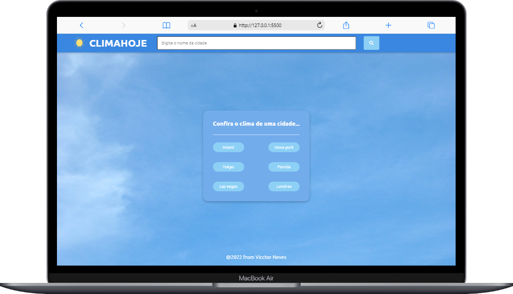
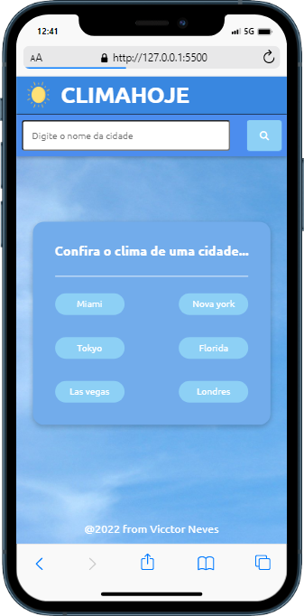

# ☀️CLIMAHOJE

## Sobre o projeto

Projeto consumindo uma API publica - [OpenWeathemap](https://openweathermap.org) - onde o usuário realiza busca do clima através do nome da cidade. Na tela inicial é possivel buscar o clima das cidades sugeridas.

[clique aqui para acessar o site](https://vicctorneve.github.io/climaAPI/)

## Previews

   
   

## Tecnologias:

- HTML
- CSS
- JAVASCRIPT
- [Biblioteca font-awesome](https://cdnjs.com/libraries/font-awesome)

## Status:

🚀 Projeto sujeito a possiveis atualizações.

- [X] Sugerir cidades padrão
- [X] Sugerir cidades pesquisadas recentemente
- [ ] Mudar imagem de acordo com o clima

